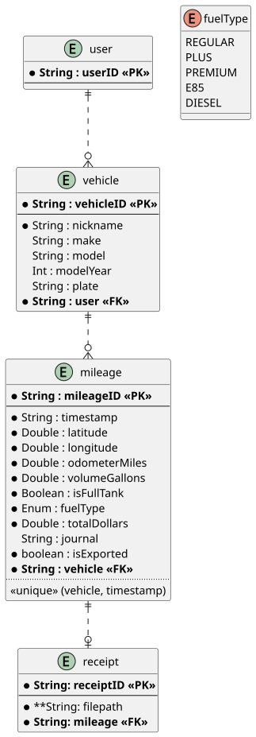

#+title: Readme
#+author: Dylan Beebe
#+options: ^:nil
#+SETUPFILE: https://fniessen.github.io/org-html-themes/org/setup/html-theme-readtheorg.setup

** General

*** Overview

This application's purpose is to provide the individual user with a succint interface to record their vehicles' mileage logs and further relay information such as fuel efficiency.

** Design

*** Requirements

**** Functional Requirements

- CRUD Vehicle

- CRUD Mileage

- CRUD MileageReceipt

- UI notify user if location accuracy is poor or unavailable.

- Compute "Price per Gallon" in UI when adding/viewing Mileage records.

**** Non-functional Requirements

- Illustrate core user workflows using PlantUML.

- Version controlled using Git with public GitHub repo.

- GPLv3 license.

- Publish on Play Store with modest convenience fee.

*** Language/SDK

- Android application written in Kotlin.

- Android 8.1 (Oreo), SDK 27

*** Frameworks/Technology

- Room (SQLite3 abstraction) database for offline data caching (future remote sync possibly with Firebase).

- Jetpack Compose instead of views.

** Implementation

*** Models

**** Entity Relationship Diagram

#+begin_src plantuml :file diagrams/erd.svg :tangle diagrams/erd.puml :exports none
@startuml

entity "user" as u {
        ,* **String : userID <<PK>>**
        --
}

entity "vehicle" as v {
        ,* **String : vehicleID <<PK>>**
        --
        ,* String : nickname
        String : make
        String : model
        Int : modelYear
        String : plate
        ,* **String : user <<FK>>**
}

entity "mileage" as m {
        ,* **String : mileageID <<PK>>**
        --
        ,* String : timestamp
        ,* Double : latitude
        ,* Double : longitude
        ,* Double : odometerMiles
        ,* Double : volumeGallons
        ,* Boolean : isFullTank
        ,* Enum : fuelType
        ,* Double : totalDollars
        String : journal
        ,* boolean : isExported
        ,* **String : vehicle <<FK>>**
        ..
        <<unique>> (vehicle, timestamp)
}

entity "receipt" as mr {
        ,* **String: receiptID <<PK>>**
        --
        ,* **String: filepath
        ,* **String: mileage <<FK>>**
}

enum "fuelType" as ft {
        REGULAR
        PLUS
        PREMIUM
        E85
        DIESEL
}

u ||..o{ v
v ||..o{ m
m ||..o| mr

@enduml
#+end_src

*** Workflows

[fn:1]: My thought is that lat/lon could be used to determine, agains public record, what business the fillup takes place at using a given lat/lon and date and time combination. Maybe a pipedream but it seems like it should be possible now at least.
