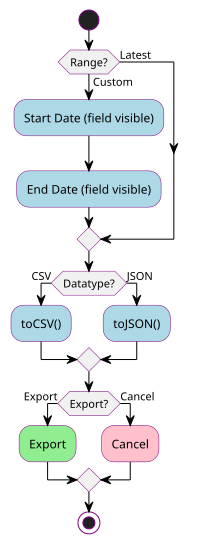

#+title: Readme
#+author: Dylan Beebe
#+options: ^:nil
#+setupfile: https://fniessen.github.io/org-html-themes/org/setup/html-theme-readtheorg.setup

* General

This application provides a succinct interface for recording vehicle mileage and reporting metrics such as fuel efficiency.

* Design

** Requirements

*** Functional Requirements
- Add/view/edit/delete vehicles

- Add/view/edit/delete mileage records

- Add/view/delete mileage attachments

- Notify the user if location accuracy is poor or unavailable.

- Compute and display average MPG in the vehicle UI.

- Compute and display price per gallon in the mileage UI.

- Display a list of vehicles on the home screen.

- Display mileage records in descending order on the vehicle screen.

- Render mileage records to indicate their non-exported status.

- Export mileage records.

*** Non-functional Requirements

- [[https://developer.android.com/topic/architecture][Maintainable application architecture]] utilizing [[https://developer.android.com/topic/architecture/recommendations][Android best practices and recommendations]].

- Version-controlled source code using Git.

- Public GitHub repository licensed under GPLv3.

- Test-driven development of the data layer, including integration tests for CRUD and ViewModel state holders, and unit tests for core business logic (e.g., average MPG calculation).

- Publish on the Play Store with a modest convenience fee.

** Language/SDK

- Android application written in Kotlin.

- Minimum SDK: Android 8.1 (API 27).

** Frameworks/Technology

- Room (SQLite abstraction) for local persistence.

- Jetpack Compose for UI.

* Implementation

** Entity Relationship Diagram

[[file:./diagrams/erd.svg]]

#+begin_src plantuml :file diagrams/erd.svg :tangle diagrams/erd.puml :exports none :results none
@startuml

entity "vehicle" as v {
        ,* **String : vehicleID <<PK>>**
        --
        ,* String : nickname
        String : make
        String : model
        Int : modelYear
        String : plate
}

entity "vehicle_attachment" as va {
        ,* **String : attachmentID <<PK>>**
        --
        ,* String : URI
        ,* **String : vehicle <<FK>>**
}

entity "mileage" as m {
        ,* **String : mileageID <<PK>>**
        --
        ,* String : timestamp
        ,* Double : odometerMiles
        ,* Double : volumeGallons
        ,* Boolean : isFullTank
        ,* Enum : fuelType
        ,* Boolean : isTopTier
        ,* Double : totalDollars
        String : journal
        ,* Boolean : isExported
        ,* **String : vehicle <<FK>>**
        ..
        ..
        <<unique>> (vehicle, timestamp)
}

entity "mileage_location" as ml {
        ,* **String : locationID <<PK>>**
        --
        ,* **Float : accuracy**,
        ,* **Double : latitude**,
        ,* **Double : longitude**,
        ,* **String : mileage <<FK>>**
}

entity "mileage_attachment" as ma {
        ,* **String : attachmentID <<PK>>**
        --
        ,* String : URI
        ,* **String : mileage <<FK>>**
}

enum "fuelType" as ft {
        REGULAR
        PLUS
        PREMIUM
        E85
        DIESEL
}

v ||..o{ va
v ||..o{ m
m ..> ft
m ||..o{ ma
m ||..o| ml

@enduml
#+end_src

** Timestamp

Timestamps are stored an UTC ISO-8601 ~Instant~ and further converted to ~LocalDate~ for display in the UI.

** Location

Location data for mileage logs are persisted in a related table ~mileage_location~ assisted by Android's [[https://developer.android.com/reference/android/location/LocationManager][~LocationManager~]] which provides access to system location services, which returns a [[https://developer.android.com/reference/android/location/Location][~Location~]] object fit for our table.

Forgoing time inclusion is a deliberate choice due in part of the fact that according the documentation, "no guarantee that different locations have times set from the same clock... providers may use any clock to set their time...". Majorly, **location settings are an elective feature and not required** for the application to function.

** Attachments

All attachments are stored in shared storage and therefore accessable by other apps and **not deleted** when the app is uninstalled.

*** Photo Picker

[[https://developer.android.com/training/data-storage/shared/photo-picker][Photo picker]] provides a browsable interface for the user to select an image from their device, using [[https://developer.android.com/reference/kotlin/androidx/activity/result/contract/ActivityResultContracts.PickVisualMedia][~PickVisualMedia~]] to [[https://developer.android.com/training/data-storage/shared/photo-picker#select-single-item][select a single media item]].

Once the image has been selected, a copy is made to <ATTACHMENT LOCATION>> and its filepath is persisted in its respective ~vehicle_attachment~ or ~mileage_attachment~ table.

*** Image capture.

[[https://developer.android.com/media/camera/camerax][CameraX]] and its [[https://developer.android.com/media/camera/camerax/take-photo][~ImageCapture~]] method. See codepen

*** Open Media File

Whether an vehicle or mileage attachment is identified using the photo picker or image capture methods, the resulting file's URI is persisted the ~vehicle_attachment~ or ~mile_attachment~ tables. When the app needs to display either type of attachment, it's just a matter of retrieving the image from the app-specific media store using [[https://developer.android.com/training/data-storage/shared/media#direct-file-paths][direct file paths]] and the [[https://developer.android.com/reference/android/provider/MediaStore][~MediaStore~]] API.

**  Location Accuracy Threshold

An acceptable location accuracy threshold (meters via Location.getAccuracy()) will be defined, and validation will be implemented to flag records that exceed the threshold.

According to the [[https://developer.android.com/reference/android/location/Location][~Location~]] docs, horizontal accuracy radius is measured in float meters with a 68% chance the location is within that radius.

#+begin_quote
How small does our radius need to be, while residing outside of it ~30% of the time, for any system to infer which business a fuel-up occured at? Pretty far if we're on our way to El Paso, but not so if we're in town at the intersection of 2 or more stations...
#+end_quote

In any case, location accuracy is included in the ~mileage_location~ record, and the threshold is implemented in the business logic and not enforced at the data layer.

** Average MPG

The application queries the vehicle’s last 10 mileage records and computes average miles per gallon by dividing total miles driven by total gallons pumped. This is implemented in ~VehicleDAO.selectAverageMilesPerGallonLNR~ and exposed via ~VehicleRepository.getAverageMPG~. Non-full-tank records are included as-is and ~Vehicle.isFullTank~ is retained as metadata, leaving options open for adjusting the algorithm.

** Export Mileage Records

The user taps the export button on the vehicle screen, selects either the latest (non-exported) records or a custom date range, and chooses CSV or JSON format. The application delegates export handling to a system activity (e.g., email, SMS). If all is successful, each record's ~isExported~ flag is set to ~true~.

* Screens

** Home

** Vehicle

*** Export Vehicle Mileage Form

Exports are requested via form employing conditionally rendered fields.

#+begin_src plantuml :file diagrams/export-process.svg :tangle diagrams/export-process.puml :exports none :results none
@startuml

start

if (Range?) then (Latest)
else (Custom)
        :Start Date (field visible); <<state>>
        :End Date (field visible); <<state>>
endif

if (Datatype?) then (CSV)
        :toCSV(); <<state>>
else (JSON)
        :toJSON(); <<state>>
endif

if (Export?) then (Export)
        :Export; <<export>>
else (Cancel)
        :Cancel; <<cancel>>
endif

stop

@enduml

#+end_src

* Future

** User/Firebase/et al Sync

Initially, this is a device-local, single-user application. Migration to centralized cloud storage would improve data durability across device changes and data loss scenarios.

** Lat/Lon + Timestamp Business Delineations

Currently, the application cannot determine the business where a fill-up occurred. Potential enhancements include:

1. With the latitude/longitude and timestamp of the mileage record, the system could resolve the business against a public dataset.

2. Using Optical Character Recognition (OCR) and AI to extract business information from receipt images.

** Formatted PDF Mileage Exports

Provide an option to export formatted PDF reports for either the latest (non-exported) mileage records or a custom date range. See [[https://github.com/officialBeebe/ChoreBuddy][Chore Buddy]] for implementation reference.
